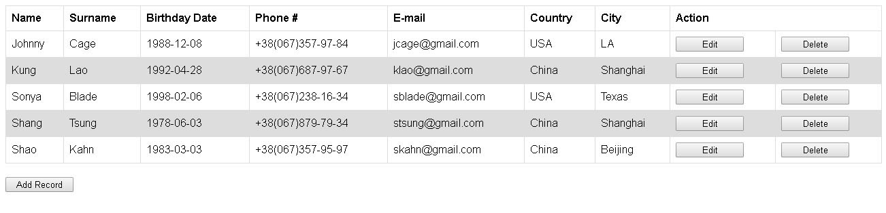
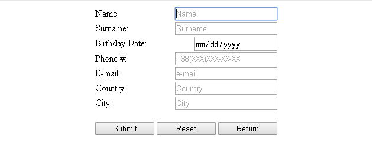

# CRUD_GuestBook

## Description:

Web Application is a typical database Create, Retrieve, Update and Delete or CRUD using JSP and MySQL. 
The Application accepts the name, surname, birthday date, phone number, e-mail, country and city of the person,
 previously check the form using HTML5, and adds information to the database, so it is just like an address book application.
 
 
 
 

## Technologies used:

- Java 8
- HTML5
- MVC design pattern using POJO, JSP and Servlet
- JDBC API to access a database
- [MySQL Community Server](https://dev.mysql.com/downloads/mysql/) as relational database management system
- [Apache Tomcat](http://tomcat.apache.org/) as Java Servlet/JSP Container 
- IDE used in project is [IntelliJ IDEA 15](https://www.jetbrains.com/idea/)
 
## Installation:
 
To get the project you can simply use this HTTPS-link:  
https://github.com/quar17esma/CRUD_GuestBook.git  

Use Dump-file for MySQL:
/other/DumpForMySQL/guest_book_db_guest_book.sql

Set database properties in:
/src/db.properties

## Disclaimer:

This project is intended for non-commercial educational purposes.